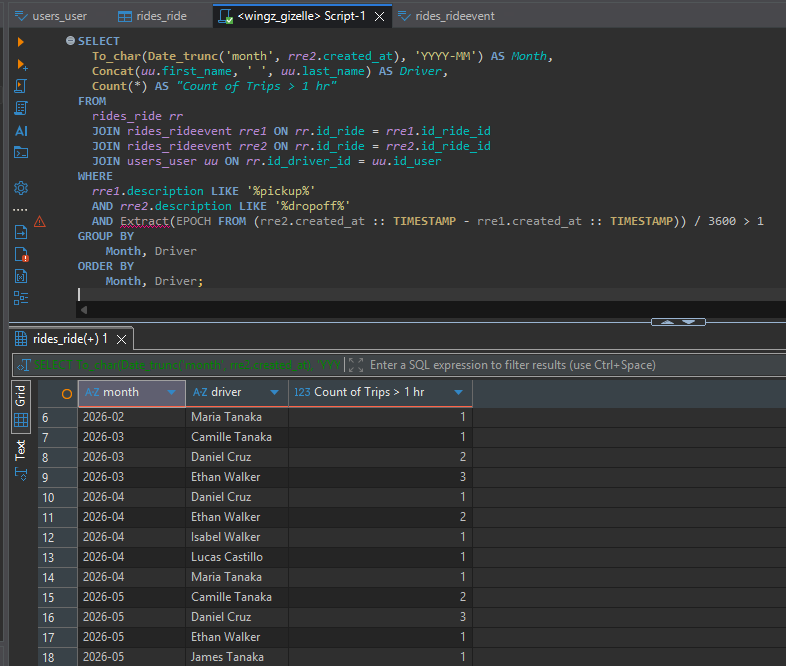
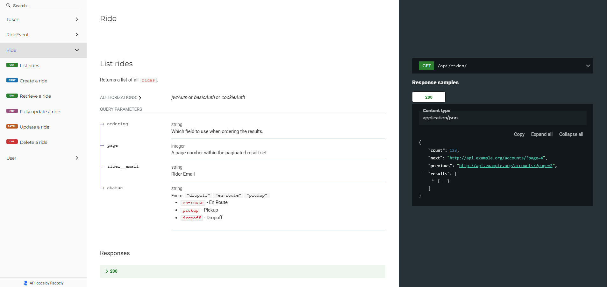
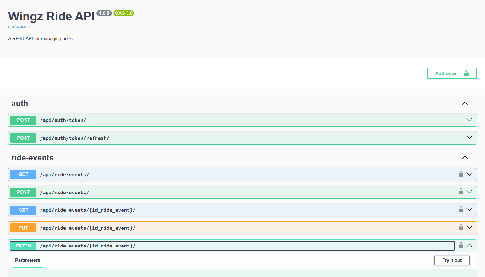

# Wingz Ride API

A REST API for managing rides.

✅ Built with Django and Django REST Framework.  
✅ Includes 3 models: User, Ride, and RideEvent, and their corresponding serializers and viewsets.  
✅ There are 3 options for authentication: JWT, Basic, or session.  
✅ Only Users with `admin` role have permission to use the APIs.  
✅ The Ride API includes filtering, sorting by distance, and pagination.  

## Tech stack

- Python 3.12, Django 6.1, Django REST Framework 3.18
- `django-filter` for filtering
- `djangorestframework-simplejwt` for JWT authentication
- SQLite by default, PostgreSQL through `DATABASE_URL`
- `black` and `flake8` for formatting and linting
- `drf-spectacular` for API docs

## Project structure

```
lib/        Shared code: ride filters, distance ordering, admin-only permission
users/      Custom User model (email login, role), serializer, viewset, admin
rides/      Ride and RideEvent models, serializers, viewsets
wingz/      Project settings and URL routing
```

## Setup

1. Create a virtual environment and install dependencies:

   ```bash
   python -m venv .venv
   source .venv/bin/activate
   pip install -r requirements.txt
   ```

2. Create a `.env` file from the example and fill in the values:

   ```bash
   cp .env.example .env
   ```

   | Variable | Required | Description |
   |---|---|---|
   | `SECRET_KEY` | Yes | Django secret key. |
   | `DEBUG` | No | Debug mode. |
   | `DATABASE_URL` | No | PostgreSQL URL. Leave it unset to use SQLite (`db.sqlite3`). |

3. Run the migrations:

   ```bash
   python manage.py migrate
   ```

4. Create an admin user. Since only users with the `admin` role can use the API, you can `createsuperuser` first to use create more users and use the API normally.  

   ```bash
   python manage.py createsuperuser
   ```
   After that, you can create more users either in Django admin at `/admin/`, or in the Browsable API `/api/` on your browser .

5. Start the server:

   ```bash
   python manage.py runserver
   ```

   The API is at `http://localhost:8000/api/`.  
   I'm testing it using Insomia, but I setup the Browsable API so you can browse it in a web browser as well.

## Authentication

Every endpoint requires an authenticated user with the `admin` role. Other users get `403 Forbidden`.

Three methods are supported:

- **JWT:** get a token pair with your email and password, then send the access token as a bearer token. Access tokens last 30 minutes and refresh tokens 30 days.

  ```bash
  curl -X POST http://localhost:8000/api/auth/token/ \
       -H "Content-Type: application/json" \
       -d '{"email": "you@example.com", "password": "your-password"}'

  curl http://localhost:8000/api/rides/ -H "Authorization: Bearer <access token>"
  ```

  Refresh the access token with `POST /api/auth/token/refresh/` and `{"refresh": "<refresh token>"}`.

- **Basic:** `curl -u your@email.com:yourpassword http://localhost:8000/api/rides/`
- **Session:** Log in through the browsable API at `/api/auth/login/`.

## Endpoints

| Endpoint | Methods | Description |
|---|---|---|
| `/api/users/` | GET, POST | List and create users |
| `/api/users/{id}/` | GET, PUT, PATCH, DELETE | Retrieve, update, and delete a user |
| `/api/rides/` | GET, POST | List and create rides |
| `/api/rides/{id}/` | GET, PUT, PATCH, DELETE | Retrieve, update, and delete a ride |
| `/api/ride-events/` | GET, POST | List and create ride events |
| `/api/ride-events/{id}/` | GET, PUT, PATCH, DELETE | Retrieve, update, and delete a ride event |
| `/api/auth/token/` | POST | Get a JWT access and refresh token |
| `/api/auth/token/refresh/` | POST | Refresh a JWT access token |
| `/admin/` | | Django admin |

List endpoints are paginated with 10 items per page. Use `?page=2` for the next page.  
I actually only allowed `POST` and `DELETE` for RideEvent before to avoid ever loading the whole RideEvent table, but since there is pagination, then I put back all http methods.

You can view the endpoints properly in the [API docs](http://localhost:8000/api/docs/), or you can try it out in [Swagger](http://localhost:8000/api/docs/swagger/) too.


### Users

Users log in with their email and password.  

Users can be of 3 roles: `admin`, `driver`, or `rider` (the default).   
*(The reqs actually only mentioned admin and others. I just added other role type that is not admin so created Users by default are not admin. But this field is not strictly used elsewhere like in Ride's driver/ride, only for API permissions.)*   

The password is write-only and is hashed when the user is created.

> [!NOTE]
> In the requirements, there was no password specified in the User table. However, the APIs only allow Users with `admin` role so this means we have to authenticate the Users calling the APIs.
> I could find a way to setup a very simple User table with only the fields specified in the requirements and just add a checking of the role of the User calling the API, however, it's not really the standard to just provide an identifier of the user.   
> The standard is to indeed authenticate a User, and Django already has a great built-in User authentication. I still tried to match it with the requirements though, so I did not use the `username` field, and just used the `email` as the username. 
> The rest of the fields (`is_superuser`, `is_staff`, `is_active`, `date_joined`, `last_login`) that come with Django's User system either have default values or nullable.
> So for testing purposes, I believe there's no problem dumping User data to the db without providing values for those fields.  
> I also needed to create my own UserManager since `createsuperuser` complains about the lack of `username` field.

### Rides

A ride links a rider and a driver, has a status (`en-route`, `pickup`, or `dropoff`), pickup and dropoff coordinates, and a pickup time.

When creating or updating a ride, pass the users' IDs as `id_rider` and `id_driver`. The responses though will just show them as nested `rider` and `driver` objects instead. 
This might be better for other apps to directly receive the user information instead of having to call a separate query.

Each ride in a response includes:
- `ride_events`: all events for the ride.
- `todays_ride_events`: only the events created in the last 24 hours. This is a rolling 24-hour window as stated in the requirements, not the current calendar date.

> [!NOTE]
> Based on my understanding of the requirements, each Ride in the response must include its related RideEvents. So that's why I included a `ride_events` with all related events of the Ride.  
> It was also specified to return an **extra field** called `todays_ride_events`, to only return the events of the last 24 hours.  
> To be honest, if the point of the `todays_ride_events` was so that the full table is not to be loaded, it really won't be loaded anyway because the Ride API is already paginated.
> So we only load the Ride Events of the specified Ride. And if the point was because the table grows very large, I would understand only loading the last 24h instead of all the related ride events.  
> But I still did optimize the queries either way. This will be separately explained under [Performance](#performance).

Example response for one ride:

```json
{
  "id_ride": 4,
  "status": "en-route",
  "rider": {"id_user": 2, "email": "rider@example.com", "role": "rider", "first_name": "", "last_name": "", "phone_number": ""},
  "driver": {"id_user": 3, "email": "driver@example.com", "role": "driver", "first_name": "", "last_name": "", "phone_number": ""},
  "pickup_latitude": 14.55,
  "pickup_longitude": 121.02,
  "dropoff_latitude": 14.6,
  "dropoff_longitude": 121.05,
  "pickup_time": "2026-09-25T08:00:00Z",
  "ride_events": [
    {"id_ride_event": 1, "id_ride": 4, "description": "Status changed to pickup", "created_at": "2026-09-25T08:01:00Z"}
  ],
  "todays_ride_events": [
    {"id_ride_event": 1, "id_ride": 4, "description": "Status changed to pickup", "created_at": "2026-09-25T08:01:00Z"}
  ]
}
```

### Filtering

| Parameter | Example | Description |
|---|---|---|
| `status` | `?status=pickup` | Rides with this status |
| `rider__email` | `?rider__email=rider@example.com` | Rides for this rider (case-insensitive) |

### Sorting

Use `ordering` with `pickup_time` or `distance`. Put `-` in front of a field for descending order, and separate fields with commas to sort by more than one:

```
/api/rides/?ordering=-pickup_time
/api/rides/?ordering=distance&lat=14.55&lng=121.02
/api/rides/?ordering=distance,-pickup_time&lat=14.55&lng=121.02
```
The order of the fields are also respected. For example: `?ordering=distance,pickup_time` sorts the records distance first, then pickup time.

Without `ordering`, rides are sorted newest first (`-id_ride`).

**Distance** is the distance in kilometres from the given `lat`/`lng` to each ride's pickup location. It's calculated in the database with the Haversine formula, so it works with pagination. 
I actually googled how to compute the distance between 2 points, and I got the  Haversine formula.

Sorting by distance requires `lat` (-90 to 90) and `lng` (-180 to 180). A missing or invalid value returns `400 Bad Request`:

```json
{"lat": ["This parameter is required when ordering by distance."], "lng": ["Must be between -180 and 180."]}
```

The browsable API's sorting widget is hidden because it only allows one field at a time. Type the `ordering` parameter in the URL instead.

## Performance

### Ride List API 

The Ride List API uses a fixed number of queries, no matter however many rides are on the page:

1. `COUNT(*)` for pagination.
2. The rides, with rider and driver joined in (`select_related`).
3. The ride events for the rides on the current page (`prefetch_related`). This doesn't load the full RideEvent table since we only filter those with the specified Ride id.

To avoid additional queries, we filter `todays_ride_events` in Python from the prefetched events. Specifically using `.all()` so it uses the prefetched and not run another query.

### Ordering 

Assuming that the Ride table is very large, we need to compute the distance in the query itself by using annotate function. This adds the computed distance property to each individual object in a QuerySet. 
It's more efficient to use Django ORM than using standard Python functions because it executes data manipulation inside the database engine rather than loading raw data into Python memory.

```python
return qs.annotate(
    distance_km=ExpressionWrapper(r * c, output_field=FloatField())
)
```

### Others

Authentication also adds queries to each request since we have to load the User table and verify the request.user:
- 1 for JWT or Basic (to load the user)
- 2 for session (the session, then the user)

## Bonus - SQL

This is the raw SQL statement I was able to come up with to return the count of Trips whose duration from Pickup to Dropoff was more than 1 hour, grouped by Month and Driver. 
```SQL
SELECT 
  To_char(Date_trunc('month', rre2.created_at), 'YYYY-MM') AS Month, 
  Concat(uu.first_name, ' ', uu.last_name) AS Driver, 
  Count(*) AS "Count of Trips > 1 hr" 
FROM 
  rides_ride rr 
  JOIN rides_rideevent rre1 ON rr.id_ride = rre1.id_ride_id 
  JOIN rides_rideevent rre2 ON rr.id_ride = rre2.id_ride_id 
  JOIN users_user uu ON rr.id_driver_id = uu.id_user
WHERE 
  rre1.description LIKE '%pickup%'
  AND rre2.description LIKE '%dropoff%' 
  AND Extract(EPOCH FROM (rre2.created_at :: TIMESTAMP - rre1.created_at :: TIMESTAMP)) / 3600 > 1 
GROUP BY
	Month, Driver 
ORDER BY 
	Month, Driver;
```
Here is the sample of the result of the SQL statement on my local db:


1. First, we select from Ride table
2. Then join the RideEvent table twice to get separate event records for pickup and dropoff
3. Then join User table for the driver information
4. Then we filter records:  
   4.1 We find from RRE1 where a description has the word "pickup"  
   4.2 We find from RRE2 where a description has the word "dropoff"  
   4.3 And compute the difference of their `created_at` in hour unit, and immediately filter those that have > 1hr  
5. Since we already have the needed tables, we now select the fields:  
   5.1 We format RRE2's `created_at` to be in YYYY-MM already  
   5.2 Then concatenate `first_name` and `last_name` to get the Driver  
6. At this point, we now have records of trips in YYYY-MM and their Driver, and the duration of the "pickup" event from "dropoff" event
7. Since these records where already filtered to be >1hr, we just count them all but grouped per Month, Driver to be able to count the trips per driver and month!

## Docs

API docs are available at [/api/docs/](http://localhost:8000/api/docs/).


We also have Swagger so you can try it out: [/api/docs/swagger/](http://localhost:8000/api/docs/swagger/)

